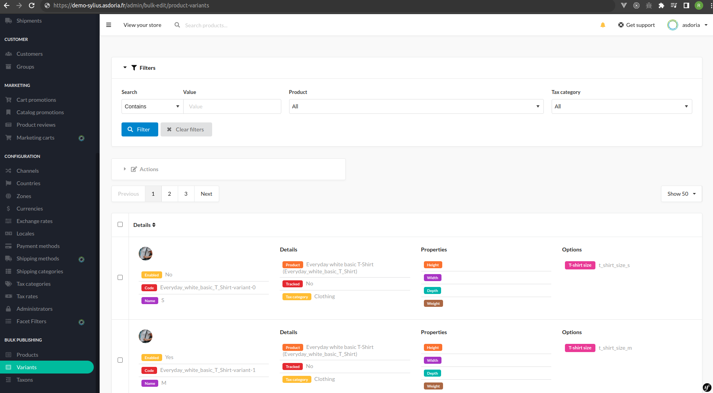

<h1 align="center">Asdoria BulkEdit Plugin</h1>

<p align="center">Simple bulk edit your Sylius shop resources</p>

<div style="max-width: 75%; height: auto; margin: auto">



</div>


## Installation

---
1. Run `composer require asdoria/sylius-bulk-edit-plugin`


2. Register the bundle in `config/bundles.php`.

```PHP
Asdoria\SyliusBulkEditPlugin\AsdoriaSyliusBulkEditPlugin::class => ['all' => true],
```

3. Import routes in `config/routes.yaml`

```yaml
asdoria_bulk_edit:
    resource: "@AsdoriaSyliusBulkEditPlugin/config/routing.yaml"
```

4. Import config in `config/packages/_sylius.yaml`
```yaml
imports:
    - { resource: "@AsdoriaSyliusBulkEditPlugin/config/config.yaml"}
```

5. Run the messenger consumer
```bash
php bin/console messenger:consume asdoria_bulk_edit
```

## Features

#### Product Variant: 
- DEMO: https://demo-sylius.asdoria.fr/admin/bulk-edit/product-variants
- Shipping Categories:
    - Edit shipping category
    - Enable / disable shipping requirement
- Tax Categories:
    - Edit Tax Category 
- Product Variants:
    - Enable / disable variant
    - Enable / disable tracked
    - Edit options (width, height, depth, weight)

#### Product:
- DEMO: https://demo-sylius.asdoria.fr/admin/bulk-edit/products
- Associations:
    - Add association type
    - Delete association type
- Attributes:
    - Add / edit attribute value 
    - Delete attribute value 
- Products:
    - Enable / disable product
- Taxons:
    - Add product taxon
    - Delete product taxon
    - Edit main taxon

#### Taxon:
- DEMO: https://demo-sylius.asdoria.fr/admin/bulk-edit/taxons
- Taxons:
    - Enable / disable taxon
    - Edit parent taxon

#### Customer:
- DEMO: https://demo-sylius.asdoria.fr/admin/bulk-edit/customers
- Customers:
    - Add / edit group
- Shop Users:
    - Enable / disable shop user

## Demo

You can try the BulkEdit plugin online by following this link: [here!](https://demo-sylius.asdoria.fr/admin/bulk-edit/products).

Note that we have developed several other open source plugins for Sylius, whose demos and documentation are listed on the [following page](https://asdoria.github.io/).

## Usage

1. Go to /admin/bulk-edit/products


## Enable/Disable infinite scroll
Use env variable `ASDORIA_BULK_EDIT_INFINITE_SCROLL`

Enable :
```yaml
ASDORIA_BULK_EDIT_INFINITE_SCROLL=1
```

Disable :
```yaml
ASDORIA_BULK_EDIT_INFINITE_SCROLL=0
```
