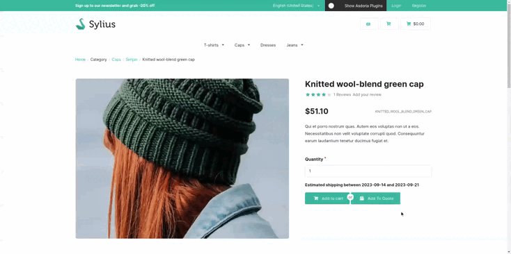

<p align="center">
</p>


<h1 align="center">Asdoria BulkEdit Plugin</h1>

<p align="center">Simply BulkEdit's Managment into Sylius Shop</p>

## Features

+ Managment Quote Request for you shop

<div style="max-width: 75%; height: auto; margin: auto">



</div>

<div style="max-width: 75%; height: auto; margin: auto">

</div>


## Installation

---
1. run `composer require asdoria/sylius-bulk-edit-plugin`


2. Add the bundle in `config/bundles.php`.

```PHP
Asdoria\SyliusBulkEditPlugin\AsdoriaSyliusBulkEditPlugin::class => ['all' => true],
```

3. Import routes in `config/routes.yaml`

```yaml
asdoria_bulk_edit:
    resource: "@AsdoriaSyliusBulkEditPlugin/config/routing.yaml"
```

4. Import config in `config/packages/_sylius.yaml`
```yaml
imports:
    - { resource: "@AsdoriaSyliusBulkEditPlugin/config/config.yaml"}
```

## Demo

You can try the BulkEdit plugin online by following this link: [here!](https://demo-sylius.asdoria.fr/en_US/bulk-edit).

Note that we have developed several other open source plugins for Sylius, whose demos and documentation are listed on the [following page](https://asdoria.github.io/).

## Usage

1. In the admin office, go to /admin/bulk-edit/products route.


